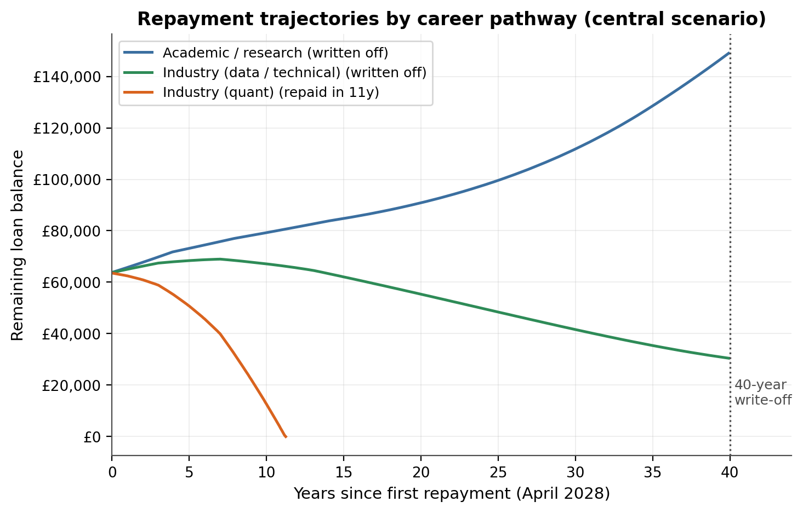
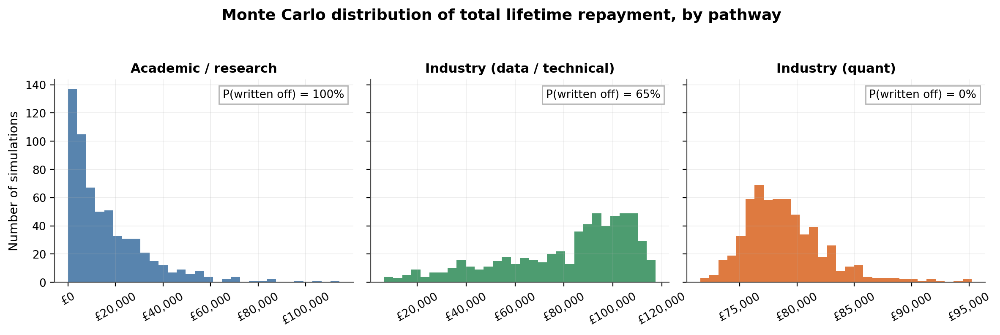
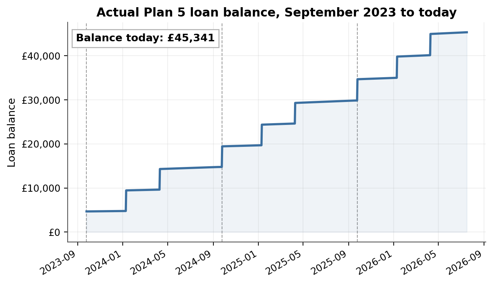
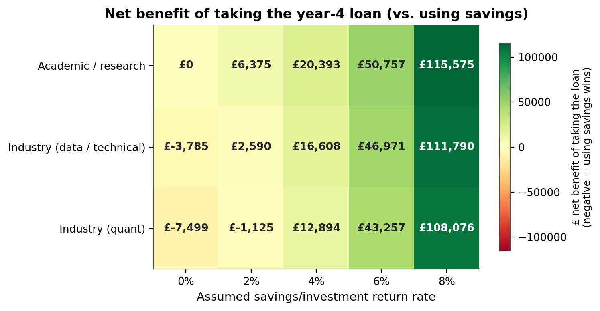

# Plan 5 Student Loan Analysis

A from-scratch quantitative analysis of the UK Plan 5 student loan: real
interest-rate history, income-contingent repayment mechanics, salary-pathway
modelling, and a specific loan-vs-savings decision for a real case (mine).

<p align="center">
  
</p>
<p align="center">
  
</p>
<p align="center">
  
  
</p>

**Status: complete.** All planned analysis, tests, and report figures are
built. See "What's built" below for the full breakdown.

## Why this isn't just "compare the interest rate to a savings rate"

Plan 5 repayments are income-contingent (9% of everything earned above
£25,000/year) and the loan is written off after 40 years regardless of the
remaining balance. That means the effective cost of borrowing an extra
pound depends heavily on your projected lifetime earnings -- for a
graduate who never earns much above the threshold, an extra pound
borrowed may cost close to nothing extra in real repayments (it just adds
to a balance that would have been written off anyway); for a high and
rising earner, it very much doesn't. So the honest way to answer "should I
borrow or use savings" requires simulating plausible income paths, not
just comparing rates.

## What's built

- **`src/plan5/rates.py`** -- loads the real, dated Plan 5 interest rate
  history (including the "Prevailing Market Rate" cap that kept the actual
  rate well below headline RPI through 2023/24-2024/25) and looks up the
  applicable rate for any date.
- **`src/plan5/fees.py`** -- historical tuition fee loan caps and
  (partially estimated) maintenance loan minimum figures by academic year.
- **`src/plan5/loan.py`** -- day-by-day loan balance simulation with daily
  compounding, validated against the analytical discrete-compounding
  formula in `tests/test_loan.py` (caught and fixed a genuine off-by-one
  bug in the day-counting during testing).
- **`src/plan5/repayment.py`** -- full income-contingent repayment
  simulation: monthly 9%-above-threshold deductions against a daily-
  compounding balance, the post-2027 RPI-linked threshold uprating, and
  the 40-year write-off. Validated in `tests/test_repayment.py` against
  hand-calculated cases (also caught and fixed a real off-by-one in the
  threshold uprating logic).
- **`src/salary/pathways.py`** -- three deterministic career-pathway
  models (academic/research, industry data/technical, industry quant),
  each with low/central/high scenarios built from real salary anchors
  (UKRI stipend rates, postdoc/lectureship pay scales, HESA graduate
  earnings, industry salary data -- see `docs/assumptions_and_sources.md`).
- **`src/salary/stochastic.py`** -- Monte Carlo layer: a *persistent*
  per-career "quality" factor (fixed for a whole simulated career, since
  promotion speed/reputation tend to compound rather than wash out year
  to year) plus year-to-year log-normal noise, calibrated against a real
  UK earnings-volatility estimate (Avram et al. 2022, via Brewer 2025).
  For the academic pathway specifically, an explicit stochastic
  postdoc-to-permanent-position hazard rate, calibrated so the eventual
  conversion probability matches real literature estimates (~20%, most
  postdocs never make it to a permanent post -- a genuinely sobering,
  well-documented statistic).
- **`scripts/01_reconstruct_current_balance.py`** -- real balance to date:
  **~£45,341** as of today (3 years borrowed so far).
- **`scripts/02_full_lifecycle_simulation.py`** -- the full pipeline on
  the three *deterministic* scenario bands: real balance -> grown to the
  first repayment date (April 2028) -> full 40-year repayment simulation.
- **`scripts/03_monte_carlo_repayment.py`** -- the same pipeline, but
  replacing the three discrete bands with an actual Monte Carlo
  probability distribution over outcomes.
- **`src/decision/loan_vs_savings.py`** and
  **`scripts/04_loan_vs_savings_decision.py`** -- the actual year-4
  decision: a *paired* Monte Carlo comparison (same simulated career used
  for both "with this year's loan" and "without it") isolating the true
  marginal extra lifetime repayment caused by borrowing this year,
  compared against the foregone growth of that same amount across a range
  of assumed savings/investment return rates.
- **`src/reporting/plots.py`** and
  **`scripts/05_generate_report_figures.py`** -- the four report figures
  shown above: the actual balance reconstruction, repayment trajectories
  by pathway, the Monte Carlo outcome distributions, and the decision
  net-benefit heatmap.

### Key finding so far

Running the full course's borrowing (all 4 years, maintenance loan taken
throughout) forward through repayment, first with three deterministic
scenarios and then properly with Monte Carlo, gives a consistent and
genuinely striking result:

| Pathway | P(written off) | Median total repaid |
|---|---|---|
| Academic/research | **~99%** | £12,300 |
| Industry (data/technical) | ~65% | £89,700 |
| Industry (quant) | **~0%** | £78,400 |

The academic pathway is written off in nearly every plausible simulated
career -- even reaching Associate Professor-level pay by the late career
essentially never clears the balance before the 40-year cutoff, because
few academics land a permanent post early enough (or at all) for their
income to run far enough ahead of the threshold for long enough. By
contrast, the quant pathway repays in full in essentially every
simulation, and industry data/technical is genuinely a coin-flip.

This matters a lot for the eventual "loan vs savings" decision: because
Plan 5 repayment amount depends only on income (not on the loan balance,
as long as the balance stays above zero), an extra pound borrowed while on
a track that's heading for write-off anyway may cost close to nothing in
extra lifetime repayments -- while the same extra pound on a track that's
going to fully repay costs real, calculable interest. The honest answer
depends on which pathway is actually plausible, which is exactly why this
project didn't stop at "compare the interest rate to a savings rate."

**And the actual year-4 answer:** the marginal extra lifetime repayment
from taking this year's maintenance loan (rather than funding it from
savings) is **£0 on the academic pathway** (it gets written off either
way), a **mean of ~£3,800 on industry/data** (median £0, but a real ~35%
chance of a substantial extra cost -- the distribution is genuinely
skewed, which is why this project reports both mean and median rather
than picking one), and a **near-certain ~£7,400-7,500 on industry/quant**
(this pathway essentially always repays in full). Compared against
foregone growth on the same amount over the ~41 years to the loan's
write-off date: **taking the loan wins outright on every pathway at a 4%+
assumed return**, and even on the worst case (quant, guaranteed full
repayment) the break-even return is only around 2-3% -- below what most
UK savings accounts have paid in recent years. The only scenario where
using savings comes out ahead is a combination of (a) a quant-like,
near-certain-full-repayment career path, and (b) assuming the savings
would otherwise earn close to 0%.

**Methodological note:** an early version of the Monte Carlo layer used
only year-to-year noise around a single central trajectory, which
collapsed every pathway to a near-100%-or-near-0% write-off probability
with no realistic middle ground -- because independent yearly noise
averages out over 40 years rather than ever shifting someone onto a
genuinely faster or slower lifetime trajectory. Adding a persistent,
career-long "quality" factor (fixed per simulated career, representing
durable differences in promotion speed that compound rather than wash
out) fixed this and produced the realistic spread shown above. See
`tests/test_stochastic.py` for the regression test this created.

## Project status

Everything planned is built and tested: 23 unit tests across 4 test files,
all passing, including regression tests for two genuine bugs caught along
the way (an off-by-one in daily interest compounding, and a modelling gap
where naive year-to-year noise collapsed every career pathway to an
unrealistic near-100%-or-near-0% write-off probability -- see the
"methodological note" above). Every real-world figure used is logged with
its source and a confidence rating in
[`docs/assumptions_and_sources.md`](docs/assumptions_and_sources.md).

## Getting started

```bash
pip install -r requirements.txt
python -m pytest tests/ -v                          # or run each test_*.py directly
python scripts/01_reconstruct_current_balance.py
python scripts/02_full_lifecycle_simulation.py       # deterministic low/central/high bands
python scripts/03_monte_carlo_repayment.py --n-sims 500     # actual probability distribution
python scripts/04_loan_vs_savings_decision.py --n-sims 500  # the actual year-4 decision
```

## License

MIT -- see [LICENSE](LICENSE).
